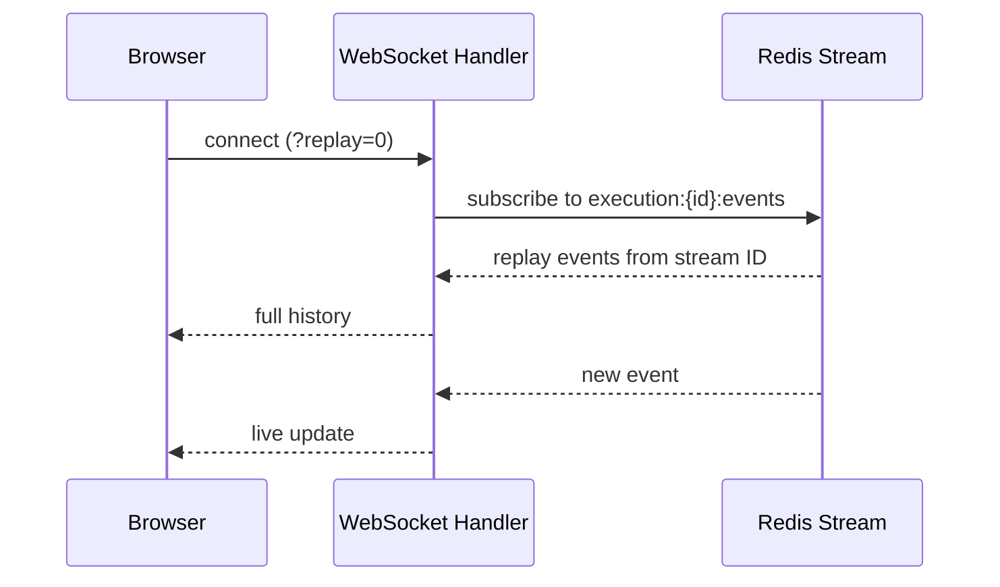

# Execution Runtime

This covers the API surface for starting, testing, and observing workflow executions. For how status actually gets from Temporal to a browser, see [Workflow Engine Architecture — Three-Tier Live Status Sync](workflow-engine/workflow-engine-overview.md#three-tier-live-status-sync-temporal-db-redis-websocket).

## Manual Runs

**`POST /executions`** — `{workflow_id, input_data?, trigger_node_id?}` starts a new execution. `trigger_node_id` selects which trigger to fire on multi-trigger workflows (defaults to the first); see [Trigger System Overview](workflow-engine/triggers/overview.md#multi-trigger-workflows).

**Two-phase creation**: the Temporal workflow is started *first*; the `Execution` database record is created only after Temporal accepts the run. This prevents orphaned DB records if Temporal rejects the workflow — both systems share a pre-generated UUID so the execution ID stays consistent either way.

## Agent Runtime Selection

Agentic nodes can use the deployment default or an explicit runtime selected at two scopes: a workflow run or an individual agent node. The effective runtime is resolved in this order: node configuration, workflow-run metadata, then `settings.agent_runtime_engine`. The override changes the Agent Orchestrator runtime behind the same Temporal activity; it does not create a second workflow type or dispatch path.

```mermaid
flowchart LR
    UI["Workflow run dialogs<br/>or agent node editor"] --> API["ExecutionCreate / workflow definition"]
    API --> ES["ExecutionService"]
    ES --> WM["workflow_context.execution"]
    WM --> DW["OrchestratorWorkflow"]
    DW --> ACT["execute_agentic_activity()"]
    ACT --> CTX["InvocationContextData"]
    CTX --> EX["InvocationExecutor"]
    EX --> RT["InProcessRuntime or SandboxedRuntime"]
```



The workflow-list and builder run dialogs expose the workflow-level choice; the AI Agent node editor persists the node-level choice. In-process runs do not need a service account. Sandboxed runs require an active service account and an active service-account credential because `_issue_gate_token()` mints the gate token for that principal. The originating user remains the workflow and execution creator; the selected service account is the runtime actor for sandbox gate authorization and audit events. The authoritative field definitions are `ExecutionCreate` in `backend/src/syntara/schemas/workflows/v2/shared-schemas.yaml` and `AgenticExecutorParameters` in `backend/src/syntara/workflows/workflow_engine/models/workflow_definition.py`.

## Single-Step / Test Execution

**`POST /workflows/{workflow_id}/test`** — `{target_node_id, trigger_inputs?, pre_resolved_nodes?, execute_target?}` runs one target node with mocked predecessor outputs, so a single node can be tested without running the whole workflow.

- Uses `ExecutionMode.TEST` — visible in the runs table but distinguished from standard runs
- The engine skips execution for any node in `pre_resolved_nodes`, substituting the mocked `{output, control}` instead
- Control-flow nodes (condition, loop, approval) being mocked must include `control.next_port` for routing to work
- Trigger nodes can't be pre-resolved — they always receive `trigger_inputs` directly
- `execute_target: false` adds the target node itself to the pre-resolved set (useful for testing downstream routing without running the target)

**Mock data from a previous run**: fetch `GET /executions/{execution_id}` with activities included, extract each `ActivityExecution.output_data`, and submit it as `pre_resolved_nodes`. `ExecutionService._validate_pre_resolved_nodes()` enforces the control-flow routing rule above.

## Live Execution Status (WebSocket)

**`WS /ws/workflows/v1/executions/{execution_id}?replay=<value>`**



`replay` is a **string**, not a boolean: omit it for live-only streaming, pass `"0"` to replay the full history from the beginning, or pass a specific Redis stream event ID to resume after a reconnect. `WebSocketStreamingHandler` delegates to `ExecutionStreamingService`, which tails `execution:{execution_id}:events`. Events cover both execution-level status transitions (`pending → running → completed`) and per-node `ActivityExecution` updates.

## Run History and Node I/O Inspection

**`GET /executions/{execution_id}/activities`** lists `ActivityExecution` records — defined in `models/activity_execution.py`. Notable fields: `activity_name` (not `name`), `status`, `started_at`/`completed_at`, `output_data`, `error_details` (**string**, not a structured object — see below), `retry_count`, `iteration` (loop index, if inside a loop). See the model for the full field list.

Records are synced from Temporal history by `activity_sync_service.py` and persist in the database after Temporal's own retention expires — the DB, not Temporal, is the durable long-term record (see the overview doc's "Auditability" point).

## Error Details

`error_details` is a plain string (`str | None`), not structured JSON:

```json
{
  "error_details": "ConfigError: Missing required field 'prompt'"
}
```

## Execution Listing and Filtering

**`GET /executions`** — filterable by `workflow_id`, `project_id`, `status`, `mode`, `completed_at`, `created_at`, `created_by`, `labels`. Status values: `pending`, `running`, `paused`, `completed`, `completed_with_errors`, `failed`, `cancelled`. Mode values: `standard`, `test`, `debug`.

Sortable by `created_at`, `updated_at`, `completed_at`, `status`, `deleted_at`, `workflow_id` — per `Execution.__sortable_fields__`; `created_by`/`updated_by` are filterable but **not** sortable.

## Signal / Callback

**`POST /executions/{execution_id}/activities/{activity_id}/signal`** — `{signal_data}` delivers external data to a Temporal activity waiting in async-completion (`STARTED`) state, completing it and resuming the workflow. Callers: the Agent Orchestrator (agentic node results), the Approvals service (approve/reject decisions), and any external system driving workflow continuation. See [Workflow Engine Architecture](workflow-engine/workflow-engine-overview.md#why-async-completion-via-signals-approval-agentic-wait) for the full signal chain and why this pattern exists.

## Related Documentation

- [Workflow Engine Architecture](workflow-engine/workflow-engine-overview.md) — three-tier sync, async completion, dispatch
- [Agentic Node](workflow-engine/agentic-node.md) — runtime propagation and sandbox identity
- [Service Accounts](service-accounts.md) — service-account requirements for sandboxed agent execution
- [Expression System](workflow-engine/expression-system.md) — how `${...}` expressions resolve node outputs
- [Workflow Structure](workflow-management.md) — the node/edge/port graph model being executed
- [WebSocket Standards](standards/websocket.md) — WebSocket connection patterns
- [Redis Standards](standards/redis.md) — Redis stream usage patterns
