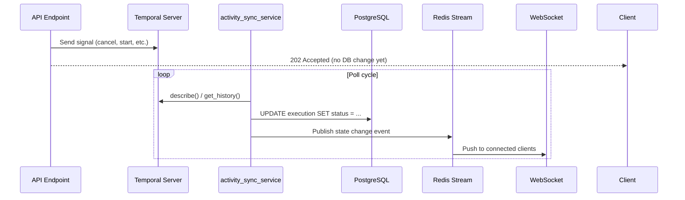
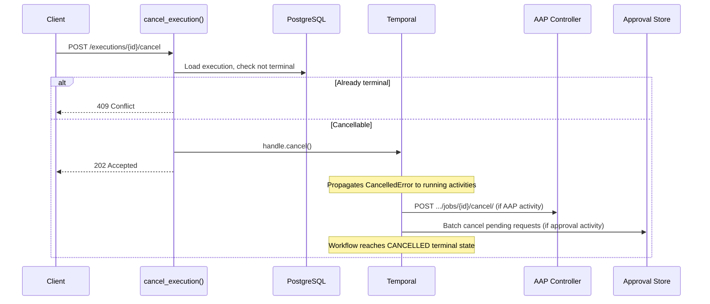
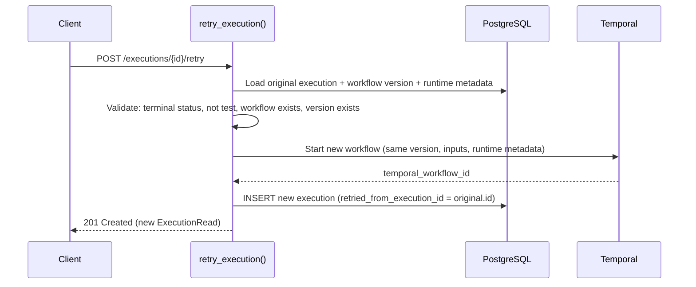

# Execution Lifecycle

## Overview

This document covers the lifecycle operations on workflow executions — cancellation, retry, and execution modes — focusing on how they interact with Temporal and why the patterns were chosen.

For field-level details, see `Execution` in `workflows/models/execution.py` and the OpenAPI spec.

## How Status Transitions Work

Execution status is **not updated directly** by API endpoints. Instead, all status transitions follow a three-tier async pipeline:

This means all lifecycle operations (cancel, retry, completion) are **eventually consistent** — the API acknowledges the request, Temporal processes it, and `activity_sync_service` propagates the state change to the database, Redis, and WebSocket clients.

**Why this pattern?** Temporal is the source of truth for workflow state. Writing status directly to the DB would create split-brain scenarios where the DB says "cancelled" but Temporal is still running activities. By letting the sync service be the sole writer, we guarantee DB state always reflects Temporal reality.

## Cancel Execution

### How It Works

### Why 202 Instead of 200?

Cancellation is asynchronous — when the API returns, the execution is still `RUNNING` in the database. The actual transition to `CANCELLED` happens when:

1. Temporal delivers `CancelledError` to the running activity
2. The activity's cancellation handler runs (e.g., cancels the AAP job)
3. The workflow reaches a terminal state
4. `activity_sync_service` picks up the change and updates the DB

### Temporal "Not Found" Handling

If the workflow has already completed before the cancel signal arrives, Temporal returns "not found". The cancel is treated as a **no-op** — no error is raised. This avoids race conditions where a workflow completes between the status check and the cancel call.

### Cancellation Propagation

Each activity type handles cancellation differently:

- **AAP nodes**: Send `POST /api/controller/v2/{job_type}/{id}/cancel/` to AAP controller (best-effort — logged but not retried if the cancel request itself fails). See [AAP Nodes — Cancellation Propagation](aap-nodes.md#cancellation-propagation) for the full fire-and-poll cancellation flow.
- **Approval nodes**: All pending approval requests for the execution are cancelled via the internal API (`cancel_approval_requests_activity`), which batch-updates their status so approvers see them as cancelled rather than still awaiting a decision.
- **Script nodes**: The container process is killed
- **Wait nodes**: The durable timer is cancelled

Both AAP and approval cancellation follow the same principle: propagate cancellation to the external system (AAP controller / approval request store) so resources aren't left dangling.

## Retry Execution

### How It Works

### Design Decision: Always Retry Same Version

Retry always re-executes the same workflow version that was originally run. This makes retry deterministic — given the same inputs, the same version's definition runs again.

The alternative (letting users pick a different version on retry) was considered and rejected. Mixing version selection into the retry flow conflates two distinct operations and is a known source of user confusion and bugs in workflow platforms that offer it. If you want to run a different version, create a new execution — that's not a retry.

### Why Test Executions Can't Be Retried

Test executions use `pre_resolved_nodes` (mocked predecessor data) and `stop_after_nodes` to isolate a single node. Retrying them would re-execute the same mock setup, which isn't meaningful — if the node definition changed, the mocks are stale; if it didn't change, the result will be identical. Users should create a new test execution instead.

### Retry Lineage

The `retried_from_execution_id` FK on `Execution` tracks which execution spawned which. This is a simple parent pointer, not a chain — retrying a retry creates `C → B` and `B → A`, not `C → A`. This keeps queries simple and avoids needing recursive traversal.

### Runtime metadata is preserved on retry

A retry preserves the original run's runtime metadata alongside its workflow version, inputs, and trigger context. This means a sandboxed run remains sandboxed and retains its selected service-account identity when retried; a node-level runtime override remains part of the workflow definition. Older executions without runtime metadata fall back to the deployment default, preserving compatibility with runs created before runtime selection was added.

## Execution Modes

Executions have a `mode` field (see `ExecutionMode` enum) that distinguishes how they were created:

- **`standard`** — Full workflow run via `POST /executions` (manual or trigger-initiated)
- **`test`** — Single-node test via `POST /workflows/{id}/test` (see [Manual Run and Testing](manual-run-and-testing.md))
- **`debug`** — Reserved for future use

### Why Modes Matter

Mode affects behavior across the system:

- **Retry**: Test executions are excluded (see above)
- **Metrics**: Test executions are excluded from production gauges to avoid skewing monitoring
- **UI**: Test runs show a distinct label in run history
- **Filtering**: Mode is a filterable field on the list executions API

Execution mode and agent runtime are independent axes: `standard`, `test`, and `debug` describe how the execution was created, while `in_process` and `sandboxed` describe where agentic nodes run. Runtime metadata does not make a test execution retryable and does not change the execution-mode filters.

## Design Decision: Dynamic `now` / `today` Resolution

`now` and `today` are **not** included in the workflow context at execution creation time. They are resolved dynamically by the workflow engine at each node execution, so they reflect wall-clock time when the node actually runs — not when the execution was created. Users who need the execution start time can use `${workflow_context.execution.created_at}`.

## Key Files

| File | What it does |
|------|-------------|
| `workflows/services/execution_service.py` | `cancel_execution()`, `retry_execution()`, `create_execution()` |
| `workflows/workflow_engine/services/temporal_execution_service.py` | `cancel_workflow()` — Temporal handle interaction |
| `workflows/workflow_engine/services/activity_sync_service.py` | Polls Temporal, propagates state to DB/Redis/WebSocket |
| `workflows/models/execution.py` | `Execution` model, `ExecutionStatus`, `ExecutionMode`, `TERMINAL_EXECUTION_STATUSES` |
| `workflows/exceptions.py` | `ExecutionInTerminalStateError`, `ExecutionNotRetryableError` |

## Related Documentation

- [Execution Runtime](../execution-runtime.md) — workflow-level runtime selection and execution metadata
- [Agentic Node](agentic-node.md) — node dispatch, runtime propagation, and sandbox identity
- [Workflow Engine Architecture](workflow-engine-overview.md) — graph dispatch and async completion
